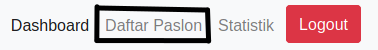
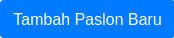
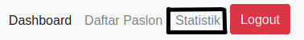

<p align="center">
  <a href="https://github.com/sekilas13/rva13"></a>
</p>

<h2 align="center">NVA 13</h2>
<h2 align="center">Node Voting App 13</h2>

---

Halo, ini adalah aplikasi yang bernama [NVA 13](https://github.com/sekilas13/rva13) yang memiliki kepanjangan `Node Voting App 13`. Aplikasi ini dibuat untuk voting langsung ditempat menggunakan komputer. Aplikasi voting ini merupakan aplikasi _real time vote app_ karena pada saat user memilih siapa yang dia pilih, admin akan mendapatkan data secara langsung tanpa susah lagi merefresh halaman.
<br /><br />

## Prerequisites

Anda butuh

- Node.js Dan NPM
- MongoDB untuk menyimpan data

## Pemakaian

### Cloning Dari Github

Jalankan perintah ini Command Line.

```sh
# https
git clone https://github.com/sekilas13/nva13.git

# SSH
git clone git@github.com:sekilas13/nva13.git
```

### Menginstall package

Anda ke root directory project dan menjalankan

```sh
npm install

# dev dependencies
npm install --save-dev
```

### Menjalankan Aplikasinya

Pertama-tama, copy file `env.example` menjadi `.env` dan isikan value yang sesuai.

Script npm yang ada mempunyai dua opsi, satu untuk development dan satu lagi untuk production.

```sh
# untuk development
npm run dev
```

```sh
# untuk production
npm start
```

Anda bisa membukanya di http://localhost:3000

### Mekanisme Pemilihan

Aplikasi ini harus dilakukan ditempat. Laptop / Komputer pemilihan harus diawasi oleh pantia pemilihan. Langkah-langkah pemilihan sebagai berikut.

> :warning: **Pastikan** .env, MongoDB dan server.js sudah diatur dengan benar.

1. Admin Mendaftarkan Akun
   <br />
   Pertama, admin harus mendaftarkan di [/admin/daftar](http://localhost:3000/admin/daftar). Masukkan email, nama, dan password.
2. Login dan Masukan Data Paslon Satu Persatu
   <br />
   Kedua, admin login ke [/admin/daftar](http://localhost:3000/admin/login) dengan akun yang telah di daftarkan. Setelah berhasil login tambahkan daftar paslon, klik Daftar Paslon dan Tambah Paslon Baru. Isikan nama ketua dan wakil serta masukan gambar kedua paslon.
   <br /><br />
   
   
3. Lakukan Pemilihan
   <br />
   Komputer / Laptop pemilih mengakses halaman landing page di [/](http://localhost:3000) dan pemilihan berlangsung sesuai dengan agenda pemilihan yang telah ditentukan. Data pemilihan akan disimpan di MongoDB sesuai dengan apa yang dipilih, dan juga dapat diketahui hasilnya secara _real time_ dengan mengakses halaman [/admin/statistik](http://localhost:3000/admin/statistik) dan akan ditampilkan hasil pemilihan real time sementara.
   <br /><br />
   

## Dibuat dengan

- [Node.js](https://nodejs.org/en/) - Software untuk backend
- [MongoDB](https://www.mongodb.com/) - Database penyimpanan data
- [ExpressJS](https://expressjs.com/) - Web framework untuk backend
- [Bootstrap](https://getbootstrap.com/) - Web framework frontend untuk memperindah tampilan
- [jQuery](https://jquery.com/) - Library JavaScript untuk menghandle front-end
- [Socket.io](https://socket.io/) - Library Real Time Websocket
