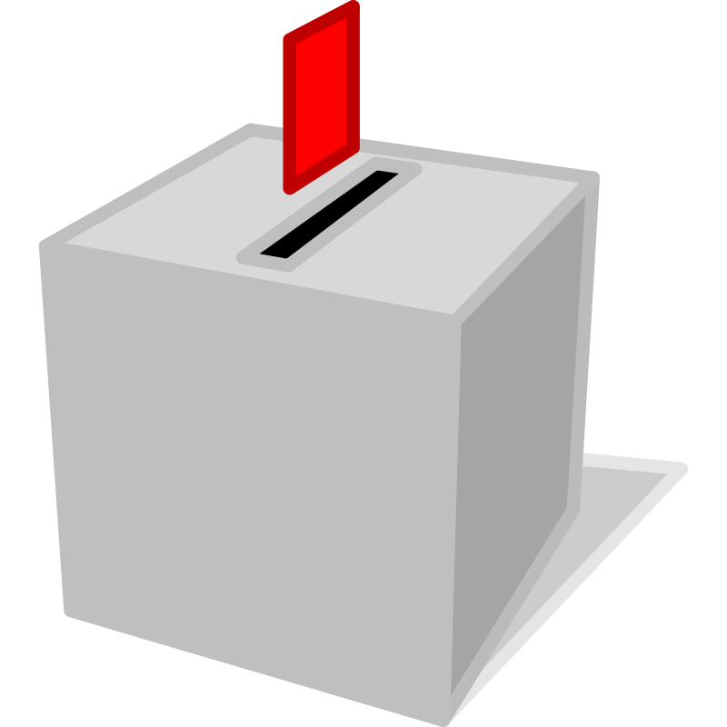

<p align="center">
  <a href="https://github.com/sekilas13/rva13"></a>
</p>

<h2 align="center">NVA 13</h2>
<h2 align="center">Node Voting App 13</h2>

---

Halo, ini adalah aplikasi yang bernama [NVA 13](https://github.com/sekilas13/rva13) yang memiliki kepanjangan `Node Voting App 13`. Aplikasi ini dibuat untuk voting langsung ditempat menggunakan komputer. Aplikasi voting ini merupakan aplikasi _real time vote app_ karena pada saat user memilih siapa yang dia pilih, admin akan mendapatkan data secara langsung tanpa susah lagi merefresh halaman.
<br /><br />

## Prerequisites

Anda butuh

- Node.js Dan NPM
- MongoDB untuk menyimpan data

## Pemakaian

### Cloning Dari Github

Jalankan perintah ini Command Line.

```sh
# https
git clone https://github.com/sekilas13/nva13.git

# SSH
git clone git@github.com:sekilas13/nva13.git
```

### Menginstall package

Anda ke root directory project dan menjalankan

```sh
npm install

# dev dependencies
npm install --save-dev
```

### Menjalankan Aplikasinya

Mempunyai dua opsi satu untuk development dan satu lagi untuk production.

```sh
# untuk development
npm dev
```

```sh
# untuk production
npm start
```

Anda bisa membukanya di http://localhost:4000

## Dibuat dengan

- [Node.js](https://nodejs.org/en/) - Software untuk backend
- [MongoDB](https://www.mongodb.com/) - Database penyimpanan data
- [ExpressJS](https://expressjs.com/) - Web framework untuk backend
- [Bootstrap](https://getbootstrap.com/) - Web framework frontend untuk memperindah tampilan
- [Socket.io](https://socket.io/) - Library Real Time Websocket
